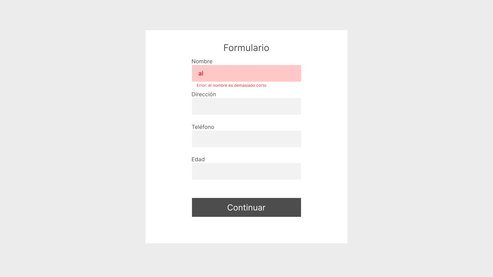

#Microproyecto 4 - Validación de formulario 

## Descripción

Crear un formulario con validacion de campos con un diseño lo mas cercano posible a la imagen de referencia.
La validación debe hacerse al hacer click en el botón de continuar y los errores de validacion deben mostrarse como en el primer campo de la imagen

### Imagenes de referencia

### Reglas de la validación

- El campo nombre debe contener al menos 2 caracteres y no permite números
- El campo dirección debe contener al menos 5 caracteres
- El campo teléfono debe solo contener números y tener entre 9 y 12 caracteres
- El campo edad debe ser un numero entre 13 y 100 caracteres

---

## Conceptos a aprender

- Manipulacion del DOM
- Manipulacion y evaluacion de cadenas de texto
- Iteracion sobre cadenas de texto (posiblemente)
- Expresiones regulares (posiblemente)
- Prevencion de comportamiento por defecto de un formulario
- Posicionamiento y estilos con css
