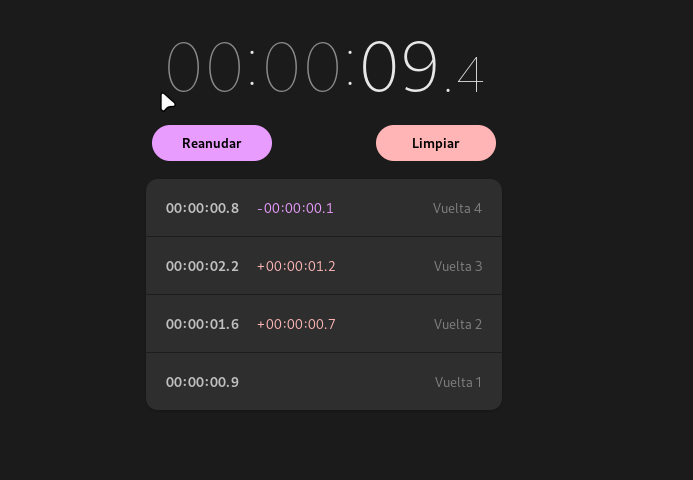

#Microproyecto  - Cronometro 

## Descripción

Crear un Cronómetro que se actualice 60 veces por segundo, con un botón de pausa, un botón de vuelta y un boton de detener.

Al hacer click en el botón de vuelta debe agregar el tiempo en el que se clickeo a la lista de vueltas.
Al hacer click en el botón de pausa debe pausarse y el boton de pausa debe convertirse en el boton de "continuar".
Al hacer click en el botón de detener este debe convertirse en el boton "reiniciar" el cual reinicia todo el cronometro incluyendo las vueltas.

### Imagenes de referencia

;
;
;

---

## Conceptos a aprender

-Tickers y/o temporizadores (setTimeout, setInterval, o bucles for para tiempo preciso)
-Posicionamiento, bordes radiales, y espaciado con css.
-Administracion simple del estádo en Javascripa.

### Credito del diseño: Gnome Clocks

